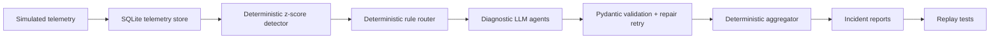

# LLM Cost Investigator

Agentic LLM cost anomaly investigator for diagnosing sudden spend spikes in LLM-backed features.

## Why LLM Cost Anomalies Matter

Uncontrolled cost growth in LLM applications can occur rapidly due to software defects, recursive loops, or misconfigurations. Detecting cost spikes deterministically is easy, but identifying *why* they happened requires deep semantic analysis of the underlying API telemetry (e.g., distinguishing between a model upgrade, an infinite retry storm, or expanding prompts). This investigator automates diagnostics using specialized agent roles.

## Architecture

The control plane uses a deterministic detection and routing pipeline to coordinate diagnostic LLM agents:



## Deterministic Detector/Router

- **Detector**: Computes z-scores on telemetry (cost, tokens, retries, latency) relative to baseline metrics.
- **Router**: Uses deterministic routing rules based on z-score signals to route the anomaly to the correct diagnostic agent (e.g. routing to the model routing agent when a model change is detected).

## Diagnostic Agents and Fallback Mode

Diagnostic agents (`retry_loop_agent`, `token_context_agent`, `model_routing_agent`) are restricted to narrow telemetry slices, keeping prompt tokens small and highly focused. Responses are validated using Pydantic schemas. 

If validation fails, a repair retry is executed. When API keys are absent, or live calls fail twice, the system falls back to a deterministic fallback module to safely complete execution.

## Setup

Install dependencies:

```bash
pip install -e .
```

Optional API keys for live LLM diagnostic agents:

```bash
export GROQ_API_KEY=your_key_here    # Groq provider
export CEREBRAS_API_KEY=your_key     # Cerebras provider
export LLM_MODEL=llama-3.3-70b-versatile  # optional model override
```

Or create a `.env` file in the project root (keys are loaded automatically):

```text
GROQ_API_KEY=gsk_your_key_here
CEREBRAS_API_KEY=your_key_here
```

Without API keys the system automatically uses deterministic fallback mode.

## Run Commands

Single scenario (deterministic fallback):

```bash
python3 main.py --scenario retry_loop
python3 main.py --scenario context_bloat
python3 main.py --scenario model_misroute
```

Run all three scenarios:

```bash
python3 main.py --scenario all
python3 main.py --scenario all --force-fallback
```

Live LLM diagnosis (when an API key is configured):

```bash
python3 main.py --scenario model_misroute --provider groq
```

Run replay tests:

```bash
python3 replay_tests.py
```

## Sample `--force-fallback` Output

Output from running a model misroute scenario using deterministic fallback:

```text
Fallback used: model_routing_agent (fallback provider explicitly selected)

Scenario:         model_misroute
Detected anomaly: summarizer cost spike
Routed agents:    model_routing_agent
Root cause:       expensive_model_misroute
Confidence:       0.95
Report:           reports/model_misroute_incident.md
Result:           PASS
```

## Scenario Matrix

| Scenario | Root Cause | Routed Agent | Signal Pattern |
|---|---|---|---|
| `retry_loop` | `uncapped_retry_loop` | `retry_loop_agent` | High retry count, repeated parent calls, latency growth |
| `context_bloat` | `context_bloat_self_calling_agent` | `token_context_agent` | Expanding input tokens, deep call chain |
| `model_misroute` | `expensive_model_misroute` | `model_routing_agent` | Model switched to pricier model, stable token count |

## Reports

Each run writes structured incidents to the `reports/` folder:

- `reports/<scenario>_incident.json`
- `reports/<scenario>_incident.md`

Markdown reports contain flat, human-readable sections summarizing findings, evidence provenance, and recommendations.

## Replay Tests

Replay tests validate detector, router, agent routing, aggregator, and markdown/JSON report generations against mock telemetry recordings. Run using:

```bash
python3 replay_tests.py
```

## Resume Bullet

Built an agentic LLM cost anomaly investigator using deterministic z-score
detection, cost-aware agent routing, Pydantic-validated diagnostic LLM agents,
and replay tests against labeled retry-loop, context-bloat, and
model-misrouting incidents.
