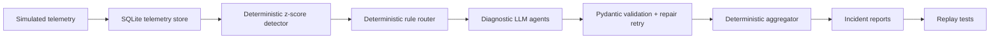

# LLM Cost Investigator

Agentic LLM cost anomaly investigator for diagnosing sudden spend spikes in LLM-backed features.

## Why LLM Cost Anomalies Matter

Uncontrolled cost growth in LLM applications can occur rapidly due to software defects, recursive loops, or misconfigurations. Detecting cost spikes deterministically is easy, but identifying *why* they happened requires deep semantic analysis of the underlying API telemetry (e.g., distinguishing between a model upgrade, an infinite retry storm, or expanding prompts). This investigator automates diagnostics using specialized agent roles.

## Architecture

The control plane uses a deterministic detection and routing pipeline to coordinate diagnostic LLM agents:



Presentation layer (optional):

```text
data/reports + data/replay  -->  web/api (FastAPI)  -->  web/frontend (React replay UI)
```

## Repository layout

```text
llm_cost_investigator/   # core pipeline package + CLI
tests/                   # automated tests
web/
  api/                   # FastAPI read-only replay API
  frontend/              # React investigation replay UI
data/
  reports/incidents/     # generated incident JSON/MD
  reports/transcripts/   # live tool-use captures
  replay/                # normalized UI fixtures
scripts/
  live/                  # live provider harnesses
  export_replay_catalog.py
  dev_replay.sh
docs/plans/              # design / build plans
```

## Deterministic Detector/Router

- **Detector**: Computes z-scores on telemetry (cost, tokens, retries, latency) relative to baseline metrics.
- **Router**: Uses deterministic routing rules based on z-score signals to route the anomaly to the correct diagnostic agent (e.g. routing to the model routing agent when a model change is detected).

## Diagnostic Agents and Fallback Mode

Diagnostic agents (`retry_loop_agent`, `token_context_agent`, `model_routing_agent`) are restricted to narrow telemetry slices, keeping prompt tokens small and highly focused. Responses are validated using Pydantic schemas.

If validation fails, a repair retry is executed. When API keys are absent, or live calls fail twice, the system falls back to a deterministic fallback module to safely complete execution.

## Setup

Install core package:

```bash
pip install -e .
```

Install core + web (replay API):

```bash
pip install -e ".[web]"
```

Optional API keys for live LLM diagnostic agents:

```bash
export GROQ_API_KEY=your_key_here    # Groq provider
export CEREBRAS_API_KEY=your_key     # Cerebras provider
export LLM_MODEL=openai/gpt-oss-120b  # optional model override
```

Or copy `.env.example` to `.env` in the project root (keys are loaded automatically):

```text
GROQ_API_KEY=gsk_your_key_here
CEREBRAS_API_KEY=your_key_here
```

Without API keys the system automatically uses deterministic fallback mode.

## Run Commands

Preferred CLI:

```bash
python -m llm_cost_investigator.cli --scenario retry_loop
python -m llm_cost_investigator.cli --scenario context_bloat
python -m llm_cost_investigator.cli --scenario model_misroute
# or after install:
llm-cost-investigator --scenario all --force-fallback
```

Compatibility shim (same as above):

```bash
python3 main.py --scenario all
```

Live LLM diagnosis (when an API key is configured):

```bash
python -m llm_cost_investigator.cli --scenario model_misroute --provider groq
```

Run tests:

```bash
python3 tests/test_replay.py
```

## Investigation replay UI

Build fixtures from reports/transcripts, then start API + UI:

```bash
python3 scripts/export_replay_catalog.py

# terminal 1
PYTHONPATH=web:. uvicorn api.app:app --reload --port 8000

# terminal 2
cd web/frontend && npm install && npm run dev
```

Or one script:

```bash
./scripts/dev_replay.sh
```

- API: http://127.0.0.1:8000  
- UI: http://127.0.0.1:5173  

## Sample `--force-fallback` Output

```text
Fallback used: model_routing_agent (fallback provider explicitly selected)

Scenario:         model_misroute
Detected anomaly: summarizer cost spike
Routed agents:    model_routing_agent
Root cause:       expensive_model_misroute
Confidence:       0.95
Report:           data/reports/incidents/model_misroute_incident.md
Result:           PASS
```

## Scenario Matrix

| Scenario | Root Cause | Routed Agent | Signal Pattern |
|---|---|---|---|
| `retry_loop` | `uncapped_retry_loop` | `retry_loop_agent` | High retry count, repeated parent calls, latency growth |
| `context_bloat` | `context_bloat_self_calling_agent` | `token_context_agent` | Expanding input tokens, deep call chain |
| `model_misroute` | `expensive_model_misroute` | `model_routing_agent` | Model switched to pricier model, stable token count |

## Reports

Each run writes structured incidents under:

- `data/reports/incidents/<scenario>_incident.json`
- `data/reports/incidents/<scenario>_incident.md`

Live tool-use transcripts (from harness scripts) live under:

- `data/reports/transcripts/live_*.txt`

Normalized UI catalog fixtures:

- `data/replay/<scenario>.json`

## Replay Tests

Replay tests validate detector, router, agent routing, aggregator, and markdown/JSON report generation against mock telemetry. Run:

```bash
python3 tests/test_replay.py
```
